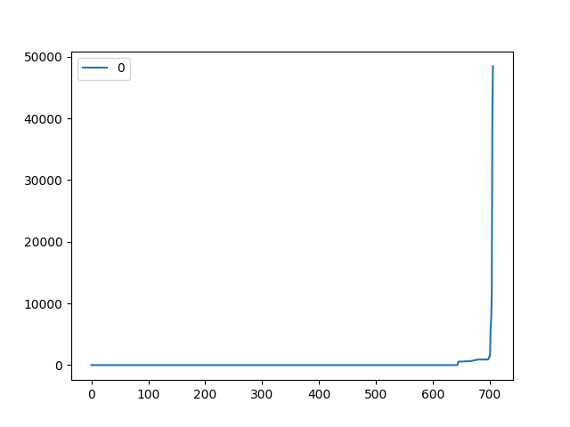

* # 🌟 AutoGPT Hackathon reports

1. `cp .env.example .env`
2. edit .env add in you pat
3. `python forks.py Significant-Gravitas AutoGPT | tee forks.json`
stop when you want to , I am updating this every day now.

4. extract the reponame
cat  forks.json  | jq -r .nameWithOwner | sort -u > repos.txt

```
for x in `cat repos.txt`; do git remote add $(echo $x| cut -d/ -f1 ) https://github.com/$x; done
```

now fetch them

```
for x in `cat repos.txt`; do git fetch $(echo $x| cut -d/ -f1 ); done
```

or in parallel
``
for x in `cat repos.txt`; do echo git fetch $(echo $x| cut -d/ -f1 ); done  | parallel -j 50
``

Now we pull in the changes since sept
```
jc git log --all --stat --since 2023-09-01 --decorate=full | jq > all_30.json
```

Extract the repos, this script needs to be rewritten
now we only use users_repos.csv from that to get the list of repos to look at.
`python report.py all_30.json`

Next we produce json.

*warning* this changes the git head, you will lose local changes!
please `git stash` all your work or commit it first.

`python run_version2.py ./users_repos.csv > git_samples2.json`

But you can call it from another dir, I prepared my second copy like this :
```
git clone Auto-GPT Auto-GPT-work
cd Auto-GPT-work/
cp ../Auto-GPT/.git/config .git/config #copy the remoted
git fetch originx
git checkout bot_prep
```

And finally we can call the other version that is fixed with this verion
```
python ../../Auto-GPT/stats/run_version2.py ../../Auto-GPT/stats/users_repos.csv > git_samples2.json
```

now `git checkout bot_prep` again to go back to your branch. 
  
`git_samples.json` is tracked in git so we want to rename `git_samples2.json`

rename:
`mv git_samples2.json git_samples.json`
  
now plot:
`python ./plot.py`

review output:




# filtering the results

Finally we can filter the results and extract out the good repos.
`python filter.py  > todo.sh`

That contains the submodule add and checkout, we apply submodule add to the vendor of ai ticket 
this transfers the bots from eval into the arena.
